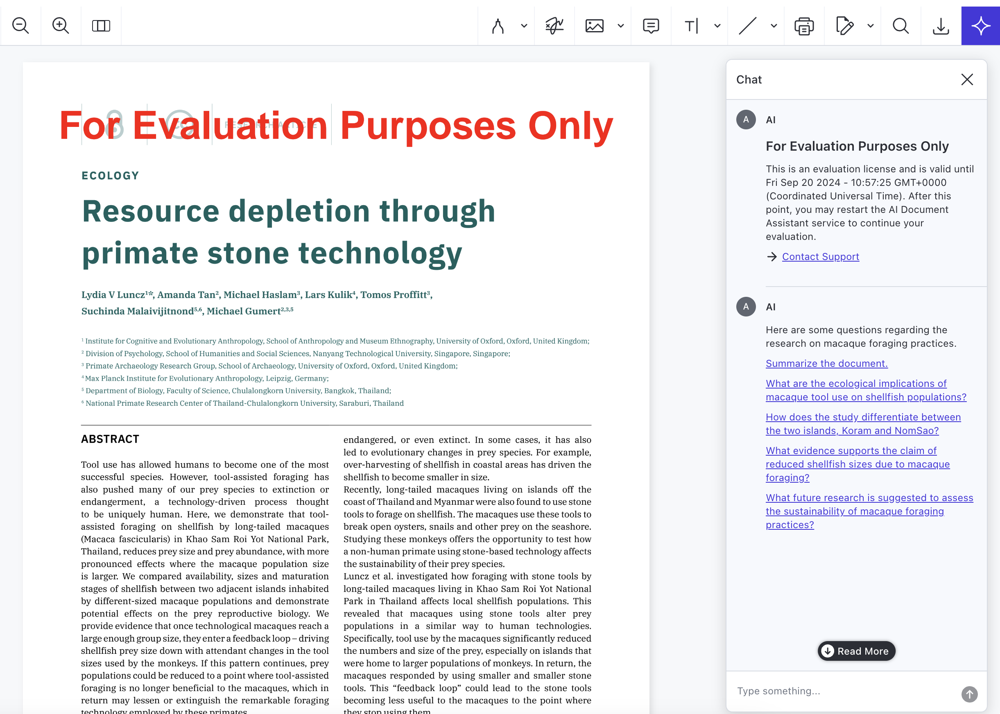

# 🤖 AI Assistant for Nutrient Demo

This project demonstrates the functionality of Nutrient AI Assistant. The AI-powered assistant enhances PDF document workflows by offering intelligent document analysis and interaction, leveraging Nutrient for seamless PDF handling and processing.

If you're interested in a demo where Nutrient Document Engine is used to store the documents, take a look at the [`document-engine`](document-engine/README.md) directory.

## Setup

### Requirements

- [Docker Compose version 3.8+](https://docs.docker.com/compose/install/)
- [Node version 20+](https://nodejs.org/en)
- [OpenAI API Key](https://openai.com/api/)

### Getting Started

Clone this repository to a folder on your computer and then run these commands in your terminal:

```shell
export OPENAI_API_KEY="your-openai-api-key"
docker compose up -d
```

When the AI Assistant is ready to use, you will see `info: AI Assistant started -` in the `ai-assistant` container logs. Then, run this command in your terminal to start the sample AI Assistant web application:

```shell
./start
```

Head over to URL listed on the command line, where you'll see a PDF loaded in the Nutrient Web SDK, our document viewer. Click on the AI Assistant toolbar icon (star) to start interacting with your document in an entirely new way, using natural language commands.



## Contact Us

Excited about the possibilities of this new technology? [Contact us](https://www.nutrient.io/contact-sales) to discuss how you can integrate it into your workflows and purchase a license after evaluation.
