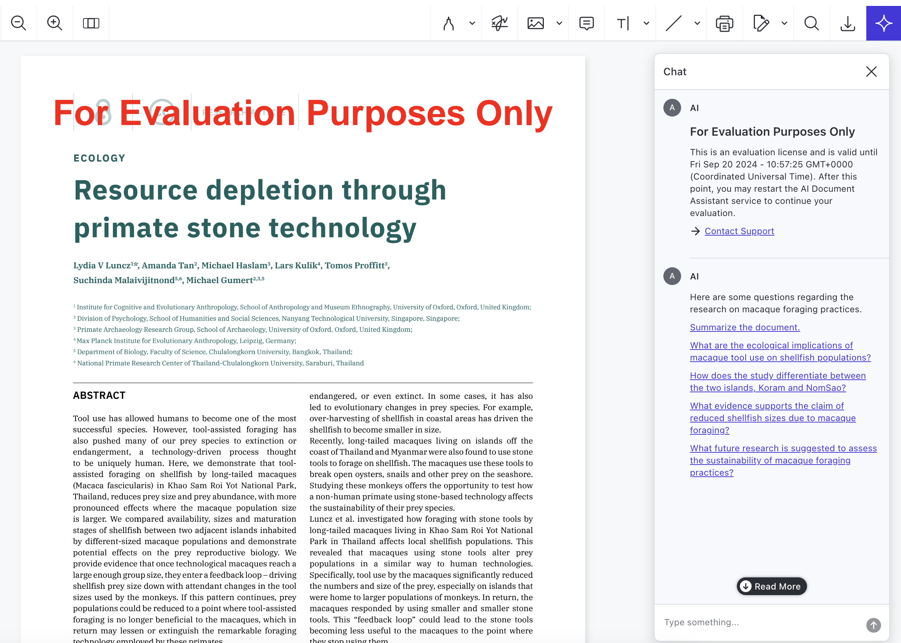

# Nutrient AI Document Assistant

> **AI-powered document understanding and manipulation — from The Document Company trusted by 15% of the Global 500.**

The Nutrient AI Document Assistant brings natural language interaction to PDF workflows. Ask questions about your documents, extract information, and get intelligent analysis — all through a conversational interface embedded directly in the document viewer.



## The Read-Write Gap

AI agents can *read* documents, but they can't reliably manipulate, annotate, or process them. Nutrient bridges this gap — providing the document infrastructure that AI needs to move from understanding to action.

This demo showcases the **AI Document Assistant**, one piece of a broader ecosystem that includes [MCP servers](https://www.nutrient.io/guides/ai/mcp/) for tool-use integration, an [agentic framework](https://www.nutrient.io/ai/) for building document-aware AI workflows, and our upcoming Vision API combining VLM-based understanding with production-grade OCR.

## What You'll Experience

- 📄 **Document Q&A** — Ask natural language questions about any loaded PDF
- 🔍 **Intelligent Extraction** — Pull out key data points, terms, and summaries
- 💬 **Conversational Context** — Follow-up questions that understand the conversation history
- 🛠️ **Embedded in the Viewer** — AI assistance right where you work with documents, not in a separate tool

## Enterprise Use Cases

| Use Case | What AI Assistant Enables |
|---|---|
| **Contract Review** | Extract key terms, identify obligations, surface renewal dates and risk clauses |
| **Compliance & Audit** | Check documents against regulatory requirements, flag missing sections |
| **Invoice Processing** | Extract line items, validate totals, identify discrepancies across documents |
| **Technical Documentation** | Q&A over specifications, manuals, and engineering documents at scale |

## Quick Start

### Prerequisites

- [Docker Compose](https://docs.docker.com/compose/install/) (v2+)
- [Node.js](https://nodejs.org/) (v20+)
- [OpenAI API Key](https://platform.openai.com/api-keys) with available credits

### 3 Steps to Running

```bash
# 1. Clone and enter the repo
git clone https://github.com/nicorr-nutrient/ai-assistant-demo.git
cd ai-assistant-demo

# 2. Set your OpenAI API key
export OPENAI_API_KEY="sk-your-key-here"

# 3. Start the backend and frontend
docker compose up -d && ./start
```

Once running, open **http://localhost:3000/documents/** and click the ⭐ **AI Assistant** button in the toolbar to start a conversation with your document.

### Try These Prompts

> - *"Summarize this document in 3 bullet points"*
> - *"What are the key dates mentioned?"*
> - *"Extract all monetary amounts and their context"*
> - *"What are the main risks or obligations outlined here?"*

## How It Works

```
┌─────────────────┐     ┌──────────────────┐     ┌─────────────┐
│  Web SDK Viewer  │────▶│  AI Assistant     │────▶│  OpenAI     │
│  (Browser)       │◀────│  (Docker)         │◀────│  GPT        │
│                  │     │                   │     │             │
│  • PDF rendering │     │  • Document       │     │  • LLM      │
│  • Annotations   │     │    processing     │     │    reasoning│
│  • Toolbar UI    │     │  • pgvector       │     │             │
│                  │     │    embeddings     │     │             │
└─────────────────┘     └──────────────────┘     └─────────────┘
```

The AI Assistant processes your document into vector embeddings stored in pgvector (PostgreSQL), enabling retrieval-augmented generation (RAG) for accurate, document-grounded responses.

## Advanced: Document Engine Mode

For production deployments where server-side document management is required, see the [`document-engine/`](document-engine/) variant. This adds [Nutrient Document Engine](https://www.nutrient.io/sdk/document-engine) for centralized document storage, processing, and multi-user collaboration.

```bash
cd document-engine/
docker compose up -d && ./start
```

## Part of the Nutrient AI Ecosystem

| Component | What It Does |
|---|---|
| **AI Document Assistant** | Natural language interaction with documents *(this demo)* |
| [**MCP Servers**](https://www.nutrient.io/guides/ai/mcp/) | Model Context Protocol integration for AI agent tool-use |
| [**Agentic Framework**](https://www.nutrient.io/ai/) | Build document-aware AI workflows and automation |
| **Vision API** | Hybrid VLM + traditional OCR for document understanding *(coming soon)* |
| [**Document Engine**](https://www.nutrient.io/sdk/document-engine) | Server-side document processing, storage, and collaboration |
| [**Web SDK**](https://www.nutrient.io/sdk/web) | In-browser PDF viewing, annotation, and editing |

## Enterprise-Ready

Nutrient is the document infrastructure trusted by enterprises worldwide:

- 🏢 **15% of the Global 500** rely on Nutrient SDKs
- 🏛️ **130+ public sector organizations** across government and defense
- 🔒 **SOC 2 Type 2** certified
- 🌍 **Cross-platform** — Web, iOS, Android, Windows, macOS, Linux, Server
- ⚡ **Developer-first** — comprehensive APIs, extensive documentation, dedicated support

## Next Steps

- **Explore the demo** — Try different document types and prompts
- **Read the docs** — [nutrient.io/guides/ai](https://www.nutrient.io/guides/ai/)
- **Talk to us** — [Contact Sales](https://www.nutrient.io/contact-sales) to discuss enterprise licensing
- **See the platform** — [nutrient.io](https://www.nutrient.io/)

---

*Built by [Nutrient](https://www.nutrient.io) — The Document Company.*
